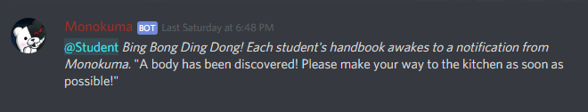
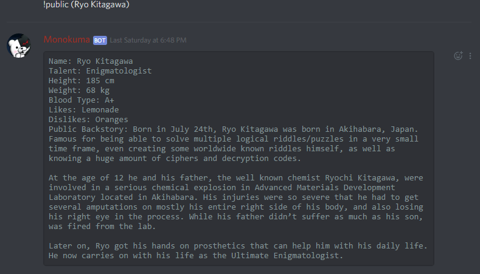

# botdiscord
Bot utilized for a Danganronpa Discord RP.

## sendto
Sends message to a channel. Arguments are:
* Channel name wrapped in parenthesis
* Message to be sent wrapped in square bracket

## sendtoid
Sends message to a channel based on their id. Arguments are:
* Channel id wrapped in parenthesis
* Message to be sent wrapped in square bracket

## add
Adds the name of a student to a list. This list is later on used for the next function.

Arguments are:
* Name of the student wrapped in parenthesis

## getroom
Pairs two students from the list previously mentioned to create a room.

No arguments required.

 

## students
Prints all the students, their status and talents.

No arguments required.

 

## kill
Kills a student from the list. 

Arguments are:
* Exact name of the student wrapped in parenthesis

 

## update
Updates the status of the students on the list by writing them on the student-file.txt file.

No arguments are required.

## announcement
Sends an announcement to a specific channel that says where someone died.

Arguments required:
* Place where the body was found wrapped in parenthesis

 

## public
Gets all the public information from a student from the student.csv file.

Arguments required:
* Name of the student

 

## Background loop
This background loops is in charge of making the time/weather announcements based on a list of your choice. It uses the time-weather.txt file to write the current weather and time so that if the bot fails, it doesn't reset back to the morning.

# Meme functions

## ship
Sends message shipping the author of it with a random person of the server.

No arguments required.

 

## nya
Beautifies a message by adding "-nya" to the end of every word.

Argument required:
* Message to be beautified

 

