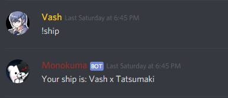

# botdiscord
Bot utilized for a Danganronpa Discord RP.

## sendto
Sends message to a channel. Arguments are:
* Channel name wrapped in parenthesis
* Message to be sent wrapped in square bracket

## sendtoid
Sends message to a channel based on their id. Arguments are:
* Channel id wrapped in parenthesis
* Message to be sent wrapped in square bracket

## ship
Sends message shipping the author of it with a random person of the server.

No arguments required.

 

## add
Adds the name of a student to a list. This list is later on used for the next function.

Arguments are:
* Name of the student wrapped in parenthesis

## getroom
Pairs two students from the list previously mentioned to create a room.

No arguments required.

 

